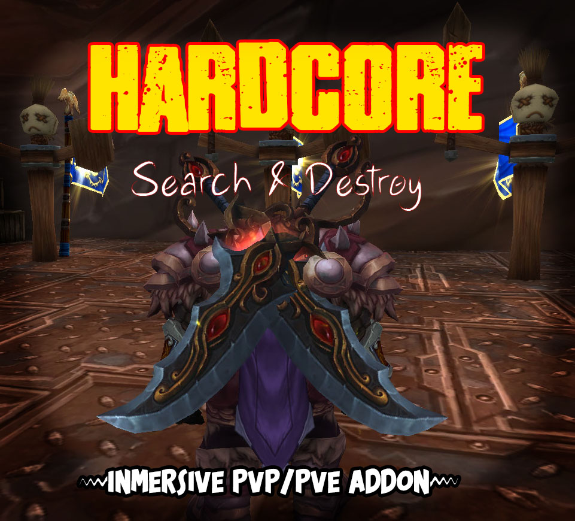
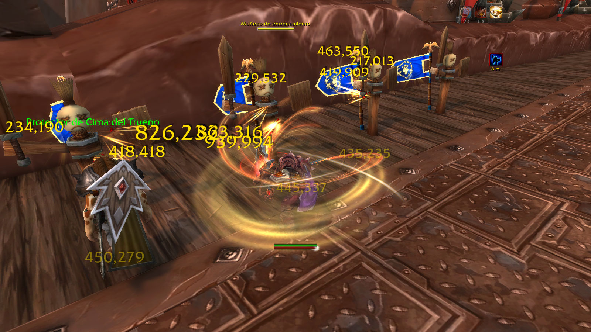

[![Contributors][contributors-shield]][contributors-url]
[![Forks][forks-shield]][forks-url]
[![Stargazers][stars-shield]][stars-url]
[![Issues][issues-shield]][issues-url]
[![MIT License][license-shield]][license-url]
[![LinkedIn][linkedin-shield]][linkedin-url]


<!-- PROJECT LOGO -->
<br />
<p align="center">
  <a href="https://github.com/CarlosCenturion/HardcoreSDLegionAddon">
    
  </a>

  <h3 align="center">HARDCORE S&D</h3>

  <p align="center">
    The only addon you need to enjoy wow again!
    <br />
    <a href="https://github.com/CarlosCenturion/HardcoreSDLegionAddon"><strong>Explore the docs »</strong></a>
    <br />
    <br />
    <a href="https://github.com/CarlosCenturion/HardcoreSDLegionAddon">View Demo</a>
    ·
    <a href="https://github.com/CarlosCenturion/HardcoreSDLegionAddon/issues">Report Bug</a>
    ·
    <a href="https://github.com/CarlosCenturion/HardcoreSDLegionAddon/issues">Request Feature</a>
  </p>
</p>


<!-- TABLE OF CONTENTS -->
<details open="open">
  <summary><h2 style="display: inline-block">Table of Contents</h2></summary>
  <ol>
    <li>
      <a href="#about-the-project">About The Project</a>
      <ul>
        <li><a href="#built-with">Built With</a></li>
      </ul>
    </li>
    <li>
      <a href="#getting-started">Getting Started</a>
      <ul>
        <li><a href="#prerequisites">Prerequisites</a></li>
        <li><a href="#installation">Installation</a></li>
      </ul>
    </li>
    <li><a href="#usage">Usage</a></li>
    <li><a href="#roadmap">Roadmap</a></li>
    <li><a href="#contributing">Contributing</a></li>
    <li><a href="#license">License</a></li>
    <li><a href="#contact">Contact</a></li>
    <li><a href="#acknowledgements">Acknowledgements</a></li>
  </ol>
</details>


<!-- ABOUT THE PROJECT -->
## About The Project

This Addon is not for noobs or casual players, this is for HardCore players only. 
Envui or other interfaces are for pussies, HardCore SD is the only thing you will ever need to enjoy wow again.
HardCore SD provides a full inmersion while allowing you to keep track of the most important things, your life and buff/debuff and your enemies lifes.

 


### Built With

* [LUA]()
* [PASSION]()
* [EXPERIENCE]()


<!-- GETTING STARTED -->
## Getting Started

You probably wont need to read this, but if you do, you probably dont deserve to use this addon at all!

### Prerequisites
 ```sh
WoW Client (Only Tested in Legion 7.3.5, should work in any version)
```
 ```sh
Full Keybind of your spells
```
 ```sh
Lot of WoW Experience
```
 ```sh
Hunger for blood
```

### Installation

1. Clone the repo or Download Binaries
   ```sh
   git clone https://github.com/CarlosCenturion/HardcoreSDLegionAddon.git
   ```
2. Copy Folder or Extract 
   ```sh
   put folder into yourWoW/Interface/Addons
   ```


<!-- USAGE EXAMPLES -->
## Usage

Once in game press F5 to toggle on and off.


<!-- ROADMAP -->
## Roadmap

See the [open issues](https://github.com/CarlosCenturion/HardcoreSDLegionAddon/issues) for a list of proposed features (and known issues).


<!-- CONTRIBUTING -->
## Contributing

Contributions are what make the open source community such an amazing place to be learn, inspire, and create. Any contributions you make are **greatly appreciated**.

1. Fork the Project
2. Create your Feature Branch (`git checkout -b feature/AmazingFeature`)
3. Commit your Changes (`git commit -m 'Add some AmazingFeature'`)
4. Push to the Branch (`git push origin feature/AmazingFeature`)
5. Open a Pull Request


<!-- LICENSE -->
## License

Distributed under the MIT License. See `LICENSE` for more information.


<!-- CONTACT -->
## Contact

Carlos Ezequiel Centurion - [@twitter_handle](https://facebook.com/charlymussogg) - CarlosEzequielCenturion@gmail.com

Project Link: [https://github.com/CarlosCenturion/HardcoreSDLegionAddon](https://github.com/CarlosCenturion/HardcoreSDLegionAddon)


<!-- ACKNOWLEDGEMENTS -->
## Acknowledgements

* [MODDING]()
* [PROGRAMMING]()
* [REVERSE-ENGINEER]()


<!-- MARKDOWN LINKS & IMAGES -->
<!-- https://www.markdownguide.org/basic-syntax/#reference-style-links -->
[contributors-shield]: https://img.shields.io/github/contributors/CarlosCenturion/HardcoreSDLegionAddon.svg?style=for-the-badge
[contributors-url]: https://github.com/CarlosCenturion/HardcoreSDLegionAddon/graphs/contributors
[forks-shield]: https://img.shields.io/github/forks/CarlosCenturion/HardcoreSDLegionAddon.svg?style=for-the-badge
[forks-url]: https://github.com/CarlosCenturion/HardcoreSDLegionAddon/network/members
[stars-shield]: https://img.shields.io/github/stars/CarlosCenturion/HardcoreSDLegionAddon.svg?style=for-the-badge
[stars-url]: https://github.com/CarlosCenturion/HardcoreSDLegionAddon/stargazers
[issues-shield]: https://img.shields.io/github/issues/CarlosCenturion/HardcoreSDLegionAddon.svg?style=for-the-badge
[issues-url]: https://github.com/CarlosCenturion/HardcoreSDLegionAddon/issues
[license-shield]: https://img.shields.io/github/license/CarlosCenturion/HardcoreSDLegionAddon.svg?style=for-the-badge
[license-url]: https://github.com/CarlosCenturion/HardcoreSDLegionAddon/blob/master/LICENSE.txt
[linkedin-shield]: https://img.shields.io/badge/-LinkedIn-black.svg?style=for-the-badge&logo=linkedin&colorB=555
[linkedin-url]: https://linkedin.com/in/CarlosCenturion
